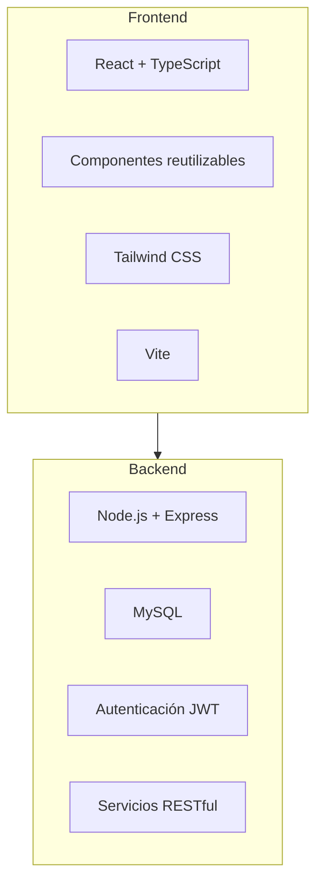
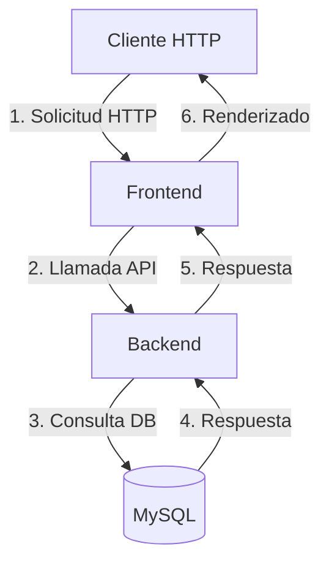

# Recycliq ♻️

Este aplicacion está desarrollada para promover el reciclaje mediante una plataforma que facilita la localización de puntos de reciclaje, foros de discusión, materiales informativos y funcionalidades personalizadas para los usuarios.

---

## Introducción

La aplicación de reciclaje consta del **frontend** desarrollado en **React con TypeScript** y el **backend** construido con **Node.js y Express**, siguiendo una arquitectura modular y limpia para garantizar un código robusto, escalable y de fácil mantenimiento. 

Además, cuenta con una **base de datos MySQL** para la persistencia de datos y utiliza el framework de CSS moderno **Tailwind CSS** para un diseño estilizado y eficiente.

---

## 1. Finalidad del Proyecto

El propósito de esta aplicación es fomentar el reciclaje y la sostenibilidad al proporcionar a los usuarios una plataforma donde puedan:

- Localizar puntos de reciclaje cercanos.
- Participar en foros para intercambiar ideas y discutir temas de reciclaje.
- Consultar materiales educativos relacionados con el reciclaje.
- Gestionar perfiles de usuario y acumular puntos basados en acciones ecológicas.

🔑 **Características destacadas:**
- CRUD completo para usuarios, foros y puntos de reciclaje.
- Sistema de autenticación y registro de usuarios.
- Consumo de servicios RESTful.
- Diseño responsivo y accesible.

---

## 2. 🏛️ Arquitectura General

El sistema sigue una arquitectura modular dividida en frontend y backend:



---

## 3. 📂 Estructura del Proyecto

### Frontend

El frontend se organiza de la siguiente manera:

```
frontend/
├── dist/                  # Archivos generados tras el build
├── docs/                  # Documentación y recursos adicionales
├── node_modules/          # Dependencias del proyecto
├── public/                # Recursos estáticos
├── src/                   # Código fuente
│   ├── assets/            # Imágenes y recursos
│   ├── components/        # Componentes reutilizables
│   │   ├── App.tsx
│   │   ├── App.css
│   │   ├── Navbar.tsx
│   │   ├── AppSidebar.tsx
│   │   ├── ui/            # Componentes UI
│   │   │   ├── badge.tsx
│   │   │   ├── button.tsx
│   │   │   ├── card.tsx
│   │   │   ├── input.tsx
│   │   │   ├── separator.tsx
│   │   │   ├── skeleton.tsx
│   │   │   ├── toast.tsx
│   │   │   └── tooltip.tsx
│   ├── hooks/             # Hooks personalizados
│   │   ├── use-mobile.tsx
│   │   └── use-toast.tsx
│   ├── lib/               # Utilidades y funciones helper
│   │   └── utils.ts
│   ├── pages/             # Páginas principales
│   │   ├── auth/          # Autenticación
│   │   │   ├── Login.tsx
│   │   │   ├── Registro.tsx
│   │   │   ├── Foro.tsx
│   │   │   ├── Index.tsx
│   │   │   ├── Inicio.tsx
│   │   │   ├── Materiales.tsx
│   │   │   ├── Perfil.tsx
│   │   │   └── PuntosReciclaje.tsx
│   │   └── ...            # Otras páginas
│   ├── services/          # Servicios para consumo de API
│   │   ├── authService.ts
│   │   ├── foroService.ts
│   │   └── puntoReciclajeService.ts
|   ├── App.css            # Estilos globales de la aplicación    
│   ├── index.tsx          # Punto de entrada
|   ├── index.css          # Estilos globales
│   ├── index.html         # Archivo HTML principal
│   ├── vite-env.d.ts      # Tipos de entorno para Vite
│   ├── .gitignore         # Ignorar archivos en Git
│   ├── babel.config.json   # Configuración de Babel
│   ├── eslint.config.js    # Configuración de ESLint
│   ├── jsdoc.config.json    # Configuración de JSDoc
│   ├── package.json       # Dependencias del proyecto
│   ├── package-lock.json  # Bloqueo de dependencias
│   ├── postcss.config.js   # Configuración de PostCSS
│   ├── README.md          # Documentación del proyecto
│   ├── tailwind.config.ts  # Configuración de Tailwind CSS
│   ├── tsconfig.app.json   # Configuración de TypeScript para la app
│   ├── tsconfig.json       # Configuración general de TypeScript
│   ├── tsconfig.node.json   # Configuración de TypeScript para Node
│   └── vite.config.ts      # Configuración de Vite

```

### Backend

El backend sigue la siguiente organización:

```
backend/
├── src/
│   ├── config/            # Configuración de la aplicación y la base de datos
│   ├── controllers/       # Lógica de manejo de rutas
│   │   ├── publicacionController.ts
│   │   ├── puntoReciclajeController.ts
│   │   └── usuarioController.ts
│   ├── middlewares/       # Autenticación y validación
│   │   └── auth.ts
│   ├── models/            # Esquemas de MongoDB
│   │   └── schema.prisma
│   ├── routes/            # Definición de endpoints
│   │   ├── puntoReciclajeRoutes.ts
│   │   └── usuarioRoutes.ts
│   ├── services/          # Lógica de negocio
│   └── utils/             # Utilidades y helpers
├── migrations/            # Migraciones de la base de datos
│   └── 20250113031743_migrations
│       └── migration_lock.toml
├── node_modules/          # Dependencias del proyecto
├── .env                   # Variables de entorno
├── index.ts               # Punto de entrada de la aplicación
├── package.json           # Dependencias del proyecto
└── tsconfig.json          # Configuración de TypeScript


```

---

## 4.  Tecnologías Utilizadas

### Frontend:
- **React** + **TypeScript**: Desarrollo del cliente.
- **Tailwind CSS**: Estilización rápida y eficiente.
- **Vite**: Herramienta de construcción.
- **Axios**: Consumo de APIs RESTful.

### Backend:
- **Node.js** + **Express**: Desarrollo de la API.
- **MySQL**: Base de datos SQL.
- **JWT**: Autenticación segura.

### Infraestructura:
- **Postman**: Pruebas de API.

---

## 5. 🚀 Configuración y Despliegue

### Requisitos Previos

- Node.js v16+
- Express.js
- MySQL

### Instalación y Configuración

1️⃣ **Clonar el repositorio:**

```bash
git clone https://github.com/luismanuelcldev/app-reciclaje.git
cd app-reciclaje
```

2️⃣ **Configurar el entorno:**

Crear un archivo `.env` para las variables de entorno del backend:

```env
MONGO_URI=mongodb://localhost:27017/reciclaje_db
JWT_SECRET=supersecretkey
PORT=4000
```

3️⃣ **Instalar dependencias:**

```bash
# En frontend/
npm install

# En backend/
npm install
```

4️⃣ **Ejecutar la aplicación:**

```bash
# Iniciar backend
cd backend & luego npm run dev

# Iniciar frontend
cd frontend & luego npm run dev
```


## 6. 🌐 Flujo de Peticiones

A continuación, se describe el flujo general de las peticiones dentro del sistema:



---

## 7. 📄 Agradecimientos

Este proyecto fue desarrollado con el propósito de promover el reciclaje y la educación ambiental. Agradezco a todas las personas que contribuyeron con ideas y retroalimentación durante su desarrollo.

---

## 8. 📜 Licencia

Este proyecto está bajo la licencia **MIT**, lo que significa que puedes usar, modificar y distribuir el código, siempre y cuando se otorgue atribución al autor original: **Luis Manuel De La Cruz Ledesma**.

Consulta el archivo **LICENSE** para más detalles.
